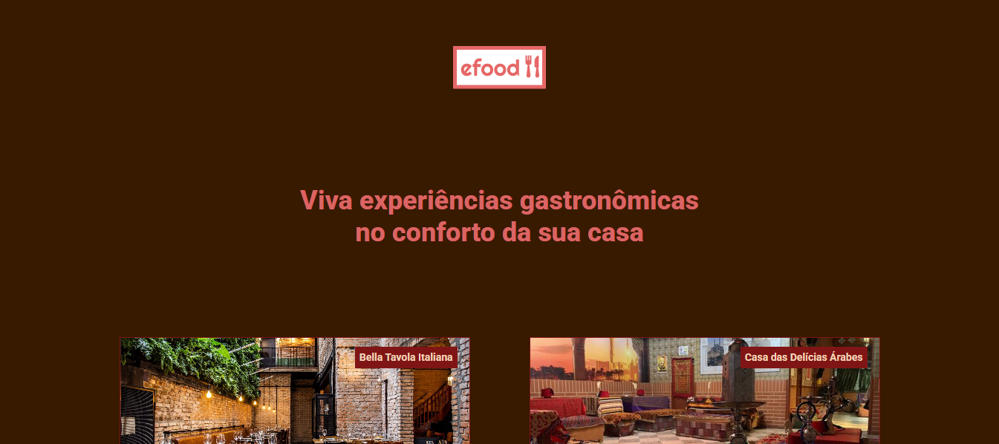

# Efood

### O projeto Efood é inspirado em um app de delivery de alimentos, simulando um fluxo de pedidos, onde o cliente consegue navegar em restaurantes, visualizar pratos, adicionar itens ao carrinho e concluir compra através de um checkout de pagamento.

## Tecnologias

* **React 19**: Biblioteca principal para construção da interface.
* **TypeScript**: Para adicionar tipagem estática e maior segurança ao código.
* **Redux Toolkit**: Gerenciamento de estado global da aplicação.
* **React Redux**: Integração oficial do Redux com o React.
* **Formik**: Biblioteca para gerenciamento e manipulação de formulários.
* **Yup**: Validação de esquemas e dados de formulários.

## O que o projeto propõe

* Arquitetura front-end escalável
* Gestão global do estado com Redux Toolkit
* Tratamento de solicitações assíncronas
* TypeScript para digitação e segurança
* Tratamento e validação de formulários
* Componentização e estrutura de código limpa
